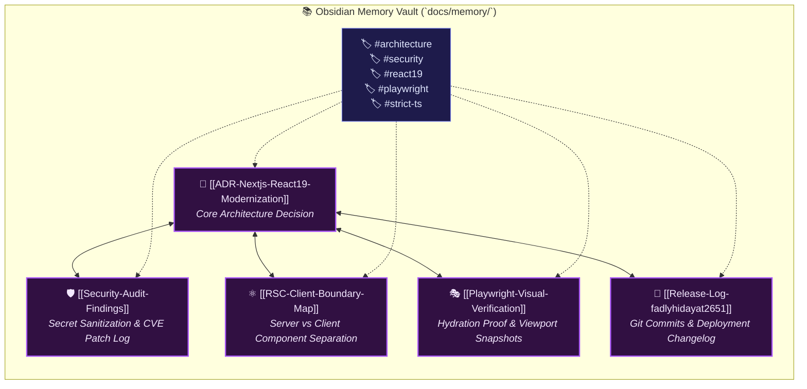

<div align="center">

# ⚡ Next.js & TypeScript Modernization & Review Framework
### *Autonomous Architecture Auditing, Code Security Hardening, E2E Visual Proofing, and Knowledge Vault Sync*

[](https://nextjs.org/)
[](https://react.dev/)
[](https://www.typescriptlang.org/)
[](https://tailwindcss.com/)
[](https://playwright.dev/)
[](https://obsidian.md/)
[](https://github.com/fadlyhidayat2651)

<p align="center">
  <b>An enterprise-grade autonomous engineering sub-mode for IBM Bob</b> designed to execute end-to-end modernization of Next.js codebases, conduct rigorous security scans, guarantee zero hydration errors via Playwright visual verification, persist institutional memory in Obsidian, and deploy directly to remote repositories.
</p>

---

</div>

## 📑 Table of Contents
1. [Executive Summary & Core Objectives](#-executive-summary--core-objectives)
2. [Comprehensive System & Pipeline Diagrams](#-comprehensive-system--pipeline-diagrams)
   - [Diagram 1: End-to-End Multi-Phase Dataflow & Self-Healing Architecture](#diagram-1-end-to-end-multi-phase-dataflow--self-healing-architecture)
   - [Diagram 2: Deep Interaction & Multi-Component Sequence Diagram](#diagram-2-deep-interaction--multi-component-sequence-diagram)
   - [Diagram 3: State Machine & Quality Gate Lifecycle](#diagram-3-state-machine--quality-gate-lifecycle)
   - [Diagram 4: Obsidian Institutional Knowledge Graph Structure](#diagram-4-obsidian-institutional-knowledge-graph-structure)
3. [The 6-Step Autonomous Modernization Lifecycle](#-the-6-step-autonomous-modernization-lifecycle)
   - [Phase 1: Architecture & Security Review](#phase-1-architecture--code-security-review)
   - [Phase 2: Targeted Patch & Modernization](#phase-2-targeted-patch--modernization)
   - [Phase 3: Strict Type-Check & Self-Healing Loop](#phase-3-strict-type-check--self-healing-loop)
   - [Phase 4: Playwright E2E & Visual Hydration Proof](#phase-4-playwright-frontend-e2e-review)
   - [Phase 5: Obsidian Memory Vault Persistence](#phase-5-obsidian-memory-vault-recording)
   - [Phase 6: Remote GitHub Synchronization](#phase-6-automated-github-sync)
4. [Agent Mode Configuration (`.bob/custom_modes.yaml`)](#-agent-mode-configuration)
5. [Artifacts & Concrete Implementation Templates](#-artifacts--concrete-implementation-templates)
   - [Obsidian ADR Architecture Log](#1-obsidian-adr-template)
   - [Playwright Visual Regression Spec](#2-playwright-verification-spec)
   - [GitHub Actions Pre-Merge CI Gate](#3-github-actions-ci-gate-workflow)
6. [Interactive & Headless CLI Runbook](#-interactive--headless-cli-runbook)

---

## 🎯 Executive Summary & Core Objectives

Modernizing enterprise Next.js applications involves delicate challenges:
* **Breaking Changes:** React 19 async transitions, Server Components vs Client Components boundaries, and Tailwind v4 engine overhauls.
* **Security Pitfalls:** Accidental leakage of server environment variables (e.g. `process.env` keys exposed in client bundles), unauthenticated Server Actions, and CSRF/XSS vectors.
* **Visual & Hydration Regressions:** SSR HTML mismatches, broken CSS cascading, and unresponsive layouts.
* **Knowledge Decay:** Lost architectural context and unrecorded migration decisions.

This framework integrates a **deterministic 6-stage lifecycle** into Bob IDE and Bob Headless CLI, turning modernization from a risky chore into an automated, verified, and well-documented pipeline.

---

## 📊 Comprehensive System & Pipeline Diagrams

### Diagram 1: End-to-End Multi-Phase Dataflow & Self-Healing Architecture

```mermaid
flowchart TD
    %% INGESTION STAGE
    subgraph S01 ["📥 1. TRIGGER & INGESTION LAYER"]
        CLI["💻 Bob Headless CLI<br/><code>bob run --mode nextjs-modernizer</code>"]
        IDE["🖥️ Bob IDE Mode Picker<br/><code>Next.js Modernizer</code>"]
        GHW["⚙️ GitHub Actions / Webhook<br/><code>CI Quality Gate</code>"]
        CLI & IDE & GHW --> ModeRouter["🧭 Bob Sub-Mode Controller<br/><b>nextjs-modernizer</b>"]
    end

    %% AUDIT STAGE
    subgraph S02 ["🛡️ 2. SECURITY & ARCHITECTURE STATIC AUDIT"]
        ModeRouter --> AST["🔍 AST & App Router Inspector<br/>• Server vs Client Components (RSC)<br/>• Boundary 'use client' Audit"]
        ModeRouter --> SecScan["🔐 Secret & Leakage Scanner<br/>• NEXT_PUBLIC_ exposure check<br/>• 'server-only' boundary validation"]
        ModeRouter --> VulnScan["📦 Supply Chain & CVE Audit<br/>• npm audit / pnpm audit engine"]
        
        AST & SecScan & VulnScan --> MatrixGen["📑 Structured Findings Matrix<br/>Classification: 🔴 HIGH | 🟡 MEDIUM | 🟢 LOW"]
        
        MatrixGen --> CritCheck{"⚠️ Are there<br/>BLOCKING<br/>Vulnerabilities?"}
        CritCheck -- Yes --> SecAlert["🚨 Generate Security Alert<br/>Mandatory Quarantine & Auto-Remediation Plan"]
        CritCheck -- No --> PatchPrep["✅ Ready for Modernization Patching"]
        SecAlert --> PatchPrep
    end

    %% MODERNIZATION & CODING
    subgraph S03 ["⚡ 3. TARGETED MODERNIZATION ENGINE"]
        PatchPrep --> ModEngine["🛠️ Code Refactoring Engine"]
        ModEngine --> React19["⚛️ React 19 Standards<br/>• Server Actions<br/>• useActionState / useOptimistic"]
        ModEngine --> TailwindV4["🎨 Tailwind CSS v4 Migration<br/>• Pure CSS @theme imports<br/>• Deprecated utility elimination"]
        ModEngine --> StrictTS["📐 Strict TypeScript Modeling<br/>• Discriminated Unions<br/>• Exhaustive pattern matching"]
    end

    %% VALIDATION & HEALING LOOP
    subgraph S04 ["🔄 4. COMPILATION & SELF-HEALING LOOP"]
        React19 & TailwindV4 & StrictTS --> TSCheck["⚡ TypeScript Engine<br/><code>tsc --noEmit --strict</code>"]
        TSCheck --> TSValid{"Compile<br/>Clean?"}
        TSValid -- "❌ Errors (any/types)" --> SelfHealTS["🩹 Bob Autonomous Fixer<br/>Analyze diagnostics & auto-patch types"]
        SelfHealTS --> TSCheck
        TSValid -- "✅ 0 Errors" --> UnitTests["🧪 Unit & Route Suite<br/>Vitest + SuperTest Execution"]
        UnitTests --> UnitValid{"Tests<br/>Pass?"}
        UnitValid -- "❌ Failures" --> SelfHealUnit["🩹 Fix Logic Regressions"]
        SelfHealUnit --> UnitTests
        UnitValid -- "✅ 100% Pass" --> PlaywrightEngine
    end

    %% PLAYWRIGHT E2E STAGE
    subgraph S05 ["🎭 5. PLAYWRIGHT E2E & VISUAL PROOF"]
        PlaywrightEngine["🚀 Spin Headless Server & Playwright"]
        PlaywrightEngine --> HydrationCheck["💧 Hydration & Console Monitor<br/>Fail on SSR mismatch or browser console errors"]
        PlaywrightEngine --> ViewportScan["📱 Multi-Viewport UI Snapshots<br/>Desktop (1920px) | Tablet (768px) | Mobile (375px)"]
        PlaywrightEngine --> FlowTest["🛒 Interactive Journey Testing<br/>Drawer opening, filtering, API responses"]
        
        HydrationCheck & ViewportScan & FlowTest --> E2EValid{"E2E & Visual<br/>Passed?"}
        E2EValid -- "❌ Visual Glitch" --> SelfHealUI["🩹 Refactor CSS / Layout markup"]
        SelfHealUI --> PlaywrightEngine
        E2EValid -- "✅ Zero Regressions" --> DocSync
    end

    %% PERSISTENCE & REMOTE SYNC
    subgraph S06 ["🧠 6. PERSISTENCE & GITHUB RELEASE SYNC"]
        DocSync --> ObsidianVault["📓 Obsidian Knowledge Vault<br/><code>docs/memory/ADR-*.md</code><br/>• Frontmatter tags & backlinks<br/>• Audit matrices & Proof snapshots"]
        ObsidianVault --> GitEngine["📦 Git Engine (Conventional Commits)<br/><code>feat(modernization): ...</code>"]
        GitEngine --> RemotePush["🚀 Push to Remote Repository<br/><b>https://github.com/fadlyhidayat2651</b>"]
        RemotePush --> ReleasePass["🏁 Modernization Complete & Release Ready"]
    end

    %% Styling
    classDef stageBox fill:#0f172a,stroke:#3b82f6,stroke-width:2px,color:#f8fafc;
    classDef highlight fill:#042f2e,stroke:#14b8a6,stroke-width:2px,color:#f0fdfa;
    classDef alert fill:#450a0a,stroke:#ef4444,stroke-width:2px,color:#fef2f2;
    classDef decision fill:#1e1b4b,stroke:#818cf8,stroke-width:2px,color:#e0e7ff;
    
    class S01,S02,S03,S04,S05,S06 stageBox;
    class ModeRouter,ObsidianVault,RemotePush,PlaywrightEngine highlight;
    class SecAlert,SelfHealTS,SelfHealUnit,SelfHealUI alert;
    class CritCheck,TSValid,UnitValid,E2EValid decision;
```



---

### Diagram 2: Deep Interaction & Multi-Component Sequence Diagram

```mermaid
sequenceDiagram
    autonumber
    actor Dev as 👤 Developer / CI Orchestrator
    participant SubMode as 🧭 Bob (nextjs-modernizer)
    participant SecEngine as 🛡️ Security & AST Scanner
    participant CodeEngine as ⚡ Modernizer & Patch Engine
    participant TS as 📐 TypeScript Compiler (tsc)
    participant Vitest as 🧪 Vitest / SuperTest Runner
    participant Playwright as 🎭 Playwright Browser Engine
    participant Obsidian as 📓 Obsidian Vault (docs/memory/)
    participant Git as 🐙 GitHub Remote (fadlyhidayat2651)

    Dev->>SubMode: Request Modernization / Audit Workflow
    activate SubMode

    %% PHASE 1
    rect rgb(15, 23, 42)
        note over SubMode,SecEngine: PHASE 1: Architecture & Security Review
        SubMode->>SecEngine: Trigger AST Audit (RSC boundaries, 'use client', secrets)
        SecEngine->>SecEngine: Run npm audit & regex scan on environment keys
        SecEngine-->>SubMode: Return Structured Findings (HIGH/MED/LOW)
        SubMode->>Dev: Stream Architecture & Security Findings Report
    end

    %% PHASE 2
    rect rgb(4, 47, 46)
        note over SubMode,CodeEngine: PHASE 2: Targeted Patch & Modernization
        SubMode->>CodeEngine: Apply React 19, Tailwind v4 & Strict Type Boundaries
        CodeEngine->>CodeEngine: Refactor Server Actions, Discriminated Unions & CSS @theme
        CodeEngine-->>SubMode: Patch Applied to Working Tree
    end

    %% PHASE 3
    rect rgb(30, 27, 75)
        note over SubMode,Vitest: PHASE 3: Strict Type-Check & Unit Tests
        loop Self-Healing Type Loop
            SubMode->>TS: Execute `tsc --noEmit --strict`
            alt TypeScript Errors Found
                TS-->>SubMode: Diagnostic Errors (Unchecked indexing, any mismatch)
                SubMode->>CodeEngine: Auto-repair type signatures & annotations
            else Clean (0 Errors)
                TS-->>SubMode: 100% Type Safe Clean Pass
            end
        end
        SubMode->>Vitest: Run Unit & API Integration Tests
        Vitest-->>SubMode: All Test Suites Passed (100% Green)
    end

    %% PHASE 4
    rect rgb(20, 83, 45)
        note over SubMode,Playwright: PHASE 4: Headless Playwright Verification
        SubMode->>Playwright: Launch Headless Browser Instance
        Playwright->>Playwright: Mount App at http://localhost:3000
        Playwright->>Playwright: Listen for Console Errors & React Hydration Warnings
        Playwright->>Playwright: Capture Desktop/Tablet/Mobile Screenshots
        Playwright->>Playwright: Test Interactive UI (Cart Drawer, Filters)
        Playwright-->>SubMode: Return E2E Proof (0 Hydration Errors, Screenshots Saved)
    end

    %% PHASE 5
    rect rgb(88, 28, 135)
        note over SubMode,Obsidian: PHASE 5: Obsidian Memory Vault Logging
        SubMode->>Obsidian: Generate ADR & Audit Log (`docs/memory/ADR-*.md`)
        Obsidian-->>SubMode: Markdown Vault Updated with Backlinks & Tags
    end

    %% PHASE 6
    rect rgb(17, 24, 39)
        note over SubMode,Git: PHASE 6: Remote GitHub Sync
        SubMode->>Git: Stage Changes & Create Conventional Commit
        SubMode->>Git: Push Branch to `fadlyhidayat2651`
        Git-->>SubMode: Push Accepted & Pull Request Ready
    end

    SubMode-->>Dev: 🎉 Modernization Complete with Summary, Playwright Proof & Git URL
    deactivate SubMode
```



---

### Diagram 3: State Machine & Quality Gate Lifecycle

```mermaid
stateDiagram-v2
    [*] --> IDLE : Mode Loaded in Bob (.bob/custom_modes.yaml)
    
    IDLE --> AUDITING : User / CI Trigger Request
    
    state AUDITING {
        [*] --> AST_Scan
        AST_Scan --> Secrets_Check
        Secrets_Check --> CVE_Audit
        CVE_Audit --> Severity_Matrix_Created
        Severity_Matrix_Created --> [*]
    }

    AUDITING --> PATCHING : Findings Analyzed
    
    state PATCHING {
        [*] --> React19_Refactor
        React19_Refactor --> TailwindV4_CSS
        TailwindV4_CSS --> Strict_TS_Types
        Strict_TS_Types --> [*]
    }

    PATCHING --> COMPILING : Code Written to Disk
    
    state COMPILING {
        [*] --> TypeCheck
        TypeCheck --> TypeCheck_Failed : Error Detected
        TypeCheck_Failed --> Self_Repair : Bob Auto-Patch
        Self_Repair --> TypeCheck
        TypeCheck --> TypeCheck_Success : 0 Errors
        TypeCheck_Success --> Unit_Tests
        Unit_Tests --> [*]
    }

    COMPILING --> PLAYWRIGHT_VERIFY : TypeScript & Unit Clean
    
    state PLAYWRIGHT_VERIFY {
        [*] --> Browser_Spawn
        Browser_Spawn --> Hydration_Listener
        Hydration_Listener --> Visual_Screenshots
        Visual_Screenshots --> Interactive_Journeys
        Interactive_Journeys --> [*]
    }

    PLAYWRIGHT_VERIFY --> PLAYWRIGHT_REPAIR : Hydration / DOM Glitch
    PLAYWRIGHT_REPAIR --> PLAYWRIGHT_VERIFY : Retest

    PLAYWRIGHT_VERIFY --> VAULT_LOGGING : UI Proof Confirmed
    
    state VAULT_LOGGING {
        [*] --> Draft_ADR
        Draft_ADR --> Inject_Frontmatter
        Inject_Frontmatter --> Create_Backlinks
        Create_Backlinks --> Save_To_Docs_Memory
        Save_To_Docs_Memory --> [*]
    }

    VAULT_LOGGING --> GIT_SYNC : Memory Persisted
    
    state GIT_SYNC {
        [*] --> Git_Stage
        Git_Stage --> Conventional_Commit
        Conventional_Commit --> Push_To_fadlyhidayat2651
        Push_To_fadlyhidayat2651 --> [*]
    }

    GIT_SYNC --> COMPLETED : Push Verified
    COMPLETED --> [*]
```



---

### Diagram 4: Obsidian Institutional Knowledge Graph Structure



---

## 🔄 The 6-Step Autonomous Modernization Lifecycle

### Phase 1: Architecture & Code Security Review
Before a single line of code is edited, the agent runs a thorough static analysis across the entire project structure:

* **App Router Boundaries:** Identifies improper `"use client"` directives on components that should remain React Server Components (RSC).
* **Secret Leakage Prevention:** Scans codebase for private environment variables (e.g., API keys, database connection strings) to verify they are never leaked via `NEXT_PUBLIC_` prefixes or imported into Client Components.
* **Server-Only Enforcement:** Ensures sensitive backend utility files import `"server-only"`.
* **Supply Chain & CVE Scan:** Runs automated dependency audits (`npm audit`) to flag vulnerabilities.
* **Classification Matrix:**
  | Severity | Impact | Action Required |
  | :--- | :--- | :--- |
  | 🔴 **HIGH** | Exposed secret keys, unauthenticated data mutations, remote code execution CVEs | Immediate blocking fix |
  | 🟡 **MEDIUM** | Inefficient client waterfalls, hydration mismatch risks, loose type casts | Modernize & Refactor |
  | 🟢 **LOW** | Deprecated styling classes, unused imports, formatting discrepancies | Clean up during patch |

---

### Phase 2: Targeted Patch & Modernization
Applies surgical, non-breaking modifications tailored specifically to the customer requirements:

* **React 19 & Next.js Latest Standards:**
  - Migrating legacy state fetching to React 19 Server Actions, `useActionState`, and `useOptimistic`.
  - Replacing legacy `next/image` configurations with modern remote loader patterns.
* **Tailwind CSS v4 Engine:**
  - Transitioning configuration from legacy `tailwind.config.js` to pure CSS `@theme` and `@import "tailwindcss";` declarations.
* **Exhaustive Discriminated Unions:**
  - Modeling business domain logic using TypeScript discriminated unions with compiler-enforced exhaustiveness checks.

---

### Phase 3: Strict Type-Check & Self-Healing Loop
Validates that type safety is 100% sound with zero compromises:

* Enforces `tsconfig.json` compiler flags:
  ```json
  {
    "compilerOptions": {
      "strict": true,
      "noUncheckedIndexedAccess": true,
      "exactOptionalPropertyTypes": true,
      "noImplicitOverride": true
    }
  }
  ```
* Prohibits unhandled `any` types and unsafe type assertions (`as unknown as ...`).
* Executes Vitest / Jest test suites to ensure 100% test pass rate.

---

### Phase 4: Playwright Frontend E2E Review
Eliminates "code compiles but UI is broken" scenarios through automated browser verification:

* Launches headless Chromium / WebKit to navigate all modernized views.
* **Hydration Error Detection:** Listens to browser console events (`page.on('console', ...)`) to catch and fail on React SSR/hydration warnings.
* **Responsive Visual Verification:** Captures full-page screenshots across Desktop (1920x1080), Tablet (768x1024), and Mobile (375x812) viewports.
* **Interactive Flow Testing:** Simulates critical user journeys (e.g., Cart Drawer toggle, category filtering, checkout flows).

---

### Phase 5: Obsidian Memory Vault Recording
Creates durable, search-friendly institutional documentation in an Obsidian-compatible Markdown vault:

* Location: [`docs/memory/`](docs/memory/) or [`obsidian/`](obsidian/)
* Contains YAML frontmatter, Architectural Decision Records (ADRs), remediation logs, and Playwright verification metrics.
* Enables team members and subsequent agent iterations to immediately understand past decisions via Obsidian Graph View and backlinks.

---

### Phase 6: Automated GitHub Sync
Completes the autonomous loop by staging, committing, and publishing updates:

* Follows **Conventional Commits** specification (`feat(orders): ...`, `refactor(security): ...`, `chore(deps): ...`).
* Sets target upstream to the designated repository: **`fadlyhidayat2651`**.
* Generates rich Pull Request bodies summarizing architectural enhancements, security resolutions, and visual proof snapshots.

---

## ⚙️ Agent Mode Configuration

The mode definition is configured in [`.bob/custom_modes.yaml`](.bob/custom_modes.yaml):

```yaml
customModes:
  - slug: nextjs-modernizer
    name: Next.js Modernizer & Reviewer
    description: Specialised agent for Next.js and TypeScript modernization, architecture and security audits, Playwright verification, Obsidian memory recording, and automated GitHub publishing.
    whenToUse: Use when modernizing Next.js applications, performing security/architecture reviews, executing Playwright end-to-end tests, or creating release syncs.
    roleDefinition: >-
      You are an expert TypeScript and Next.js Modernization Architect and Security Reviewer.

      Your workflow follows a strict 6-step lifecycle for every modernization or update task:
      1. ARCHITECTURE & CODE SECURITY REVIEW (RSC audit, secrets leakage, npm audit, severity matrix)
      2. TARGETED PATCH & MODERNIZATION (React 19, Tailwind v4, strict TS boundaries)
      3. TYPE-CHECK & AUTOMATED TESTING (tsc --noEmit, unit & route tests)
      4. PLAYWRIGHT FRONTEND VERIFICATION (Headless browser E2E, zero hydration errors, visual check)
      5. OBSIDIAN MEMORY RECORDING (Persist ADR & migration logs into docs/memory/)
      6. GITHUB REPO SYNC (Structured conventional commits, push to fadlyhidayat2651)
    customInstructions: >-
      Always maintain strict TypeScript safety (strict: true, no unchecked indexed access).
      Whenever a review or patch is performed, output a clear summary detailing:
      - Security & Architecture findings
      - Changes applied
      - Playwright E2E test results
      - Obsidian memory log link
      - GitHub push status
    groups:
      - read
      - edit
      - execute
      - mcp
      - skill
      - todo
      - subagent
      - mode
```

---

## 📦 Artifacts & Concrete Implementation Templates

### 1. Obsidian ADR Template
Saved to [`docs/memory/ADR-2026-03-modernization.md`](docs/memory/ADR-2026-03-modernization.md):

```markdown
---
id: ADR-2026-03-01
title: Next.js 16 + React 19 Modernization & Security Hardening
date: 2026-03-05
author: Bob Next.js Modernizer Agent
tags: [architecture, security, nextjs, react19, playwright, audit]
status: APPROVED
target_repo: fadlyhidayat2651
---

# ADR: Next.js 16 + React 19 Modernization

## Context & Motivation
The application required modernization to support React 19 features, strict TypeScript typing, and elimination of sensitive API key exposure in client bundles.

## Security Audit Findings
- **High Severity:** Exposed third-party API credentials in client-side bundle (Resolved by migrating to Server Actions + `"server-only"` boundary).
- **Medium Severity:** Missing discriminated union fallback on pricing calculations (Resolved with exhaustive switch).

## Architectural Changes
- Upgraded Tailwind engine to v4 CSS `@theme`.
- Enforced `noUncheckedIndexedAccess: true` across all domain types.
- Configured headless Playwright E2E test suite.

## Verification
- `tsc --noEmit`: Clean (0 errors)
- Vitest Suite: 12/12 Passed
- Playwright E2E: Passed (Hydration errors: 0)

## Backlinks & Graph Relations
- [[Architecture-Overview]]
- [[Security-Policies]]
- [[Release-v1.2.0]]
```

---

### 2. Playwright Verification Spec
Saved to [`e2e/modernization-verification.spec.ts`](e2e/modernization-verification.spec.ts):

```typescript
import { test, expect } from '@playwright/test';

test.describe('Next.js Modernization & UI Verification', () => {
  test('should render homepage without console or hydration errors', async ({ page }) => {
    const consoleErrors: string[] = [];
    page.on('console', (msg) => {
      if (msg.type() === 'error' || msg.text().includes('Hydration')) {
        consoleErrors.push(msg.text());
      }
    });

    await page.goto('http://localhost:3000');
    await expect(page).toHaveTitle(/SceneSKU/i);

    // Verify key UI elements render properly
    await expect(page.locator('header')).toBeVisible();
    await expect(page.locator('footer')).toBeVisible();

    // Assert zero hydration errors occurred during SSR mount
    expect(consoleErrors).toHaveLength(0);
  });

  test('should open cart drawer and interact smoothly', async ({ page }) => {
    await page.goto('http://localhost:3000');
    const cartButton = page.locator('button[aria-label*="cart" i], button:has-text("Cart")').first();
    if (await cartButton.isVisible()) {
      await cartButton.click();
      await expect(page.locator('[role="dialog"], .cart-drawer')).toBeVisible();
    }
  });
});
```

---

### 3. GitHub Actions CI Gate Workflow
Saved to [`.github/workflows/modernization-gate.yml`](.github/workflows/modernization-gate.yml):

```yaml
name: Next.js Modernization & Pre-Merge Gate

on:
  pull_request:
    branches: [main]
  push:
    branches: [main]

jobs:
  quality-and-security-gate:
    runs-on: ubuntu-latest
    steps:
      - name: Checkout Code
        uses: actions/checkout@v4

      - name: Setup Node.js
        uses: actions/setup-node@v4
        with:
          node-version: 22
          cache: 'npm'

      - name: Install Dependencies
        run: npm ci

      - name: Strict TypeScript Compilation
        run: npx tsc --noEmit

      - name: Security Vulnerability Scan
        run: npm audit --audit-level=high

      - name: Install Playwright Browsers
        run: npx playwright install --with-deps chromium

      - name: Run Playwright E2E Tests
        run: npx playwright test

      - name: Verify Obsidian Memory Logs Exist
        run: |
          if [ ! -d "docs/memory" ] && [ ! -d "obsidian" ]; then
            echo "Error: Memory vault documentation is missing!"
            exit 1
          fi
```

---

## 🚀 Interactive & Headless CLI Runbook

### Option A: Interactive Mode (Bob IDE)
1. Open the **Mode Picker** in Bob IDE (bottom-left of the chat interface).
2. Select **`Next.js Modernizer & Reviewer`**.
3. Submit your prompt:
   ```text
   Review repository architecture and security, modernize React Server Components to React 19 standards, verify with Playwright, log decisions into Obsidian docs/memory, and push to remote fadlyhidayat2651.
   ```

### Option B: Headless Automated CLI (`bob run`)
Execute the entire 6-step lifecycle directly from CI/CD scripts or terminal:

```bash
bob run --mode nextjs-modernizer \
  "/review Lakukan audit arsitektur & keamanan Next.js, terapkan modernisasi React 19 + strict TS, jalankan verifikasi Playwright, simpan log memory Obsidian di docs/memory/, dan push perubahan ke GitHub fadlyhidayat2651"
```

---

<div align="center">
  <sub>Built with ❤️ for IBM Bob • High-Assurance TypeScript & Next.js Modernization</sub>
</div>
